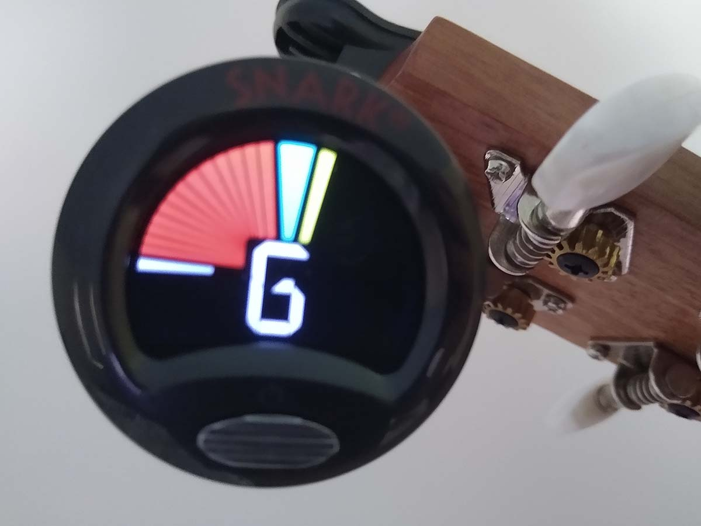
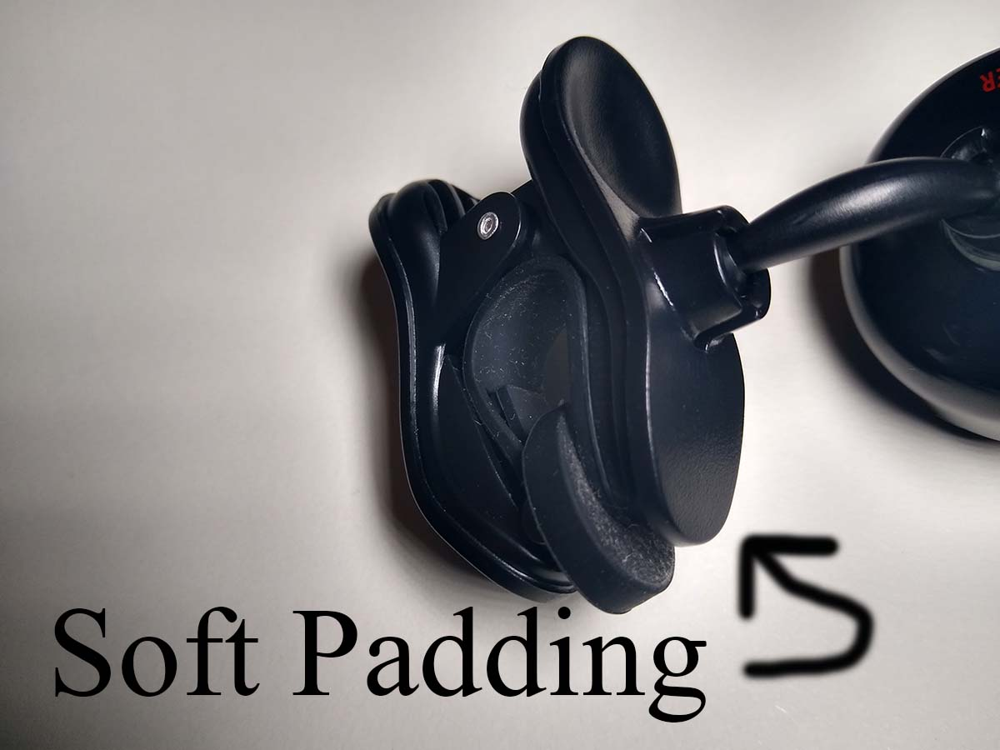
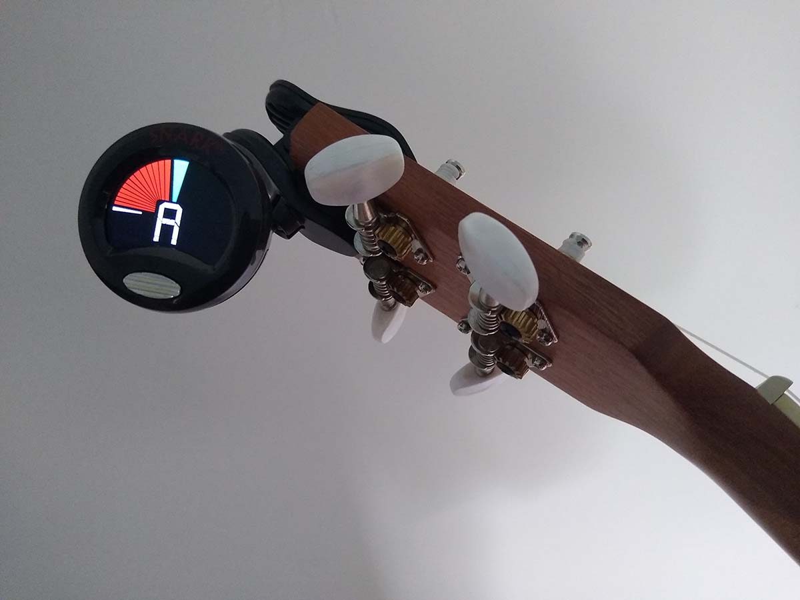

import { Link } from "gatsby"

Hands down, the best ukulele tuner in 2020 that costs around 10 dollars, is the <a href="https://amzn.to/2DpYVyS" rel="noopener noreferrer" target="_blank">
Snark SN6X</a>. As of writing this, it's about 11 dollars on Amazon.  

First of all, this is not just a ukulele tuner. I tested it on guitar and mandolin. It works
flawlessly on those instruments as well.

So what's so great about this tuner?

1. The functionality is exactly what I had in mind. I clip the tuner to the head of my ukulele,
press the power button, and it's ready to go. I am able to tune, in a room full of other people
playing other instruments, even during a song, and there is no interference whatsoever. Amazing.

 

**looks a little sharp...**

2. The display is intuitive. It shows the note played, along with a digital needle that displays
red when flat, yellow whe sharp, and green when in tune.

 

3. The clip is padded, so it hasn't damaged any of instruments. So that I have owned in the past,
left a mark on the instrument head where is was clipped on. Not this one. Speaking of the clip,
I like how it is adjustable, so that it can me positioned for best viewability while playing.

 

4. The battery lasts a really long time. This has been my go-to tuner for all of my stringed
instruments for over 2 months now, and it is still going strong.

 

All in all, you can't go wrong with this tuner. Best tuner I have ever owned.

<Link to="/posts" className="btn center-btn">
  all posts
</Link>
